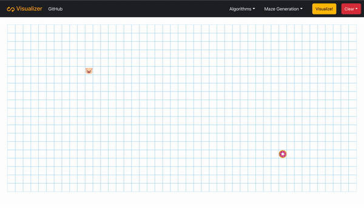

# PATHFINDING AND MAZE GENERATION VISUALIZER
This is a React application to visualize Pathfinding Algorithms and Maze Generation Algorithms. Feel free to fork or download this project so you could try it out and use this code as a foundation to create an even-better Pathfinding Visualizer :grin:.

Now, lets check it out in action :point_right: [The Visualizer](https://ho-pathfinding-visualizer.netlify.app)

## Preview (A* Search Algorithm with Random Maze): 

<p align="center">
  
</p>

## Features in the application
### Algorithms
1) Dijsktra's Algorithm
2) A* Search Algorithm
3) Breadth First Search (BFS)
4) Depth First Search (DFS)

### Maze generation algorithms
1) Random Maze
2) Recursive Division

# Getting Started
## 1. Clone the repository or download the zip
```
git clone 
```

## 2. Install the dependencies
```
npm install
```

## 3.Adding Boostrap
```
npm i bootstrap
npm i reactstrap react react-dom
```
Don't forget to import Boostrap CSS
```
import 'bootstrap/dist/css/bootstrap.css';
```

## 4. Start the application
```
npm start
```
## Thank you

I hope you enjoy the project.

-- [Hao On](https://www.linkedin.com/in/hao-on/)
